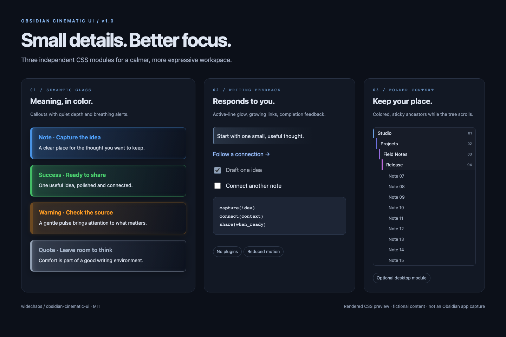
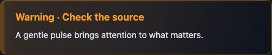

# Obsidian Cinematic UI

**Small details. Better focus.** Independent CSS modules for glass Callouts, writing feedback, and a file tree that keeps your place.

给 Obsidian 加一点有用的视觉反馈：语义玻璃提示框、写作微动效和彩色粘性目录。按需安装，随时关闭。

*Rendered CSS preview using fictional, Obsidian-shaped HTML. This is not an Obsidian app screenshot. / 上图为虚构内容的 CSS 渲染预览，并非 Obsidian 应用截图。*

## Pick your modules

| Module | What it changes | Download |
| --- | --- | --- |
| Semantic glass / 玻璃提示框 | 14 Callout families, color-coded panels, breathing warning alerts | [cinematic-callouts.css](snippets/cinematic-callouts.css) |
| Writing feedback / 写作微动效 | Active-line glow, link underlines, task completion feedback, image reveal, code hover | [cinematic-writing.css](snippets/cinematic-writing.css) |
| Folder context / 彩色粘性目录 | Six nested folder levels stay visible while scrolling; no hardcoded folder names | [cinematic-folders.css](snippets/cinematic-folders.css) |
| Essentials bundle / 基础合集 | Callouts + writing in one file; folders remain optional | [obsidian-cinematic-ui.css](snippets/obsidian-cinematic-ui.css) |

Enable the bundle **or** the first two modules. Do not enable duplicate modules together.

## See the motion

*A CSS-rendered preview of the warning cycle. Reduced-motion mode keeps the semantic color and stops animation.*

## Install

1. [Download the release pack](https://github.com/widechaos/obsidian-cinematic-ui/releases/latest), or open a CSS file above and save its **Raw** contents.
2. Copy the chosen `.css` files into `<your-vault>/.obsidian/snippets/`.
3. Open **Settings → Appearance → CSS snippets**, refresh, and enable your chosen modules.
4. Copy [the Callout demo](examples/callouts.md) or [writing demo](examples/writing.md) into a note to try it.

无需插件、联网请求或额外字体。安装与调色见 [中文说明](docs/安装与定制.md)。官方安装机制见 [Obsidian CSS snippets](https://obsidian.md/help/snippets)。

## Compatibility and limits

- The original effects were tested with Blue Topaz. This modular release is checked in Chromium against an Obsidian-shaped DOM fixture; full native Obsidian and theme coverage is still pending.
- Callouts and writing include light-theme adjustments and respect `prefers-reduced-motion`. Folder context is optional and intended for the desktop file explorer; mobile, drag-and-drop, and third-party tree plugins are not certified.
- Folder context supports six levels; deeper folders scroll normally. Colors represent depth, not a particular project.
- Image reveal runs when an image is rendered, rather than detecting network completion. Checkbox animation may replay when a view is recreated.
- No inbox pulse in the release bundle: pure CSS cannot reliably know whether a collapsed folder contains pending files.
- No wallpapers, personal vault content, analytics, or network code are bundled.

## Customize

The CSS headers expose the glow color and timing tokens. Turn off any module independently. For the folder module, change `--xwc-folder-height` to adjust the sticky row height.

An optional [folder demo guide](examples/folders.md) shows a fictional test tree. The [HTML preview](examples/preview.html) runs locally without external assets; [preview tooling](docs/preview-tooling.md) explains how to reproduce the images.

## License

MIT © 2026 widechaos. Existing themes, wallpaper, and fonts remain their respective authors' work.
